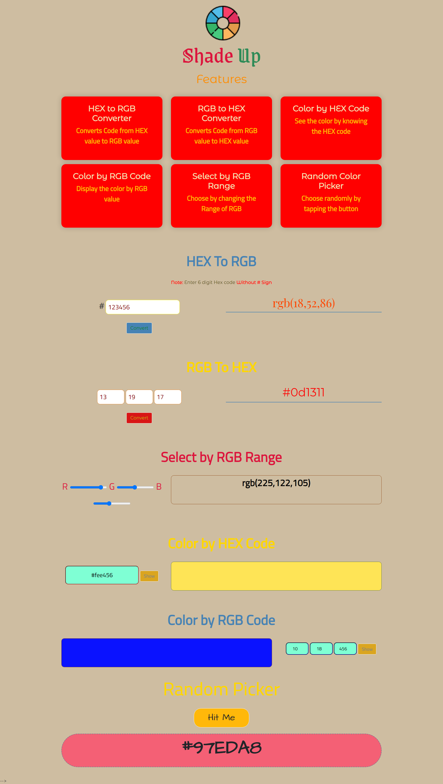

# ⭐ Project - ShadeUp ⭐

This project  is made from pure HTML,CSS and Javascript.

 

📌 Learnings:

👉 1\. HTML, CSS and DOM Manipulation.  
👉 2\. RBG to Hex and Hex to RGB conversion.  
👉 3\. Generating random hex color code.  

 

> ⏲ Time taken to build this project is 2 hour.

  

## Links

🔗 [Live](javascriptmyshadeup.netlify.app) 

🔗 [Linkedin](https://www.linkedin.com/in/pratyush-kesarwani-2b6601171/)

### Acknowledgements:

I am thankful to Hitesh Choudhary sir, Anurag sir and iNeuron team for this amazing bootcamp.
